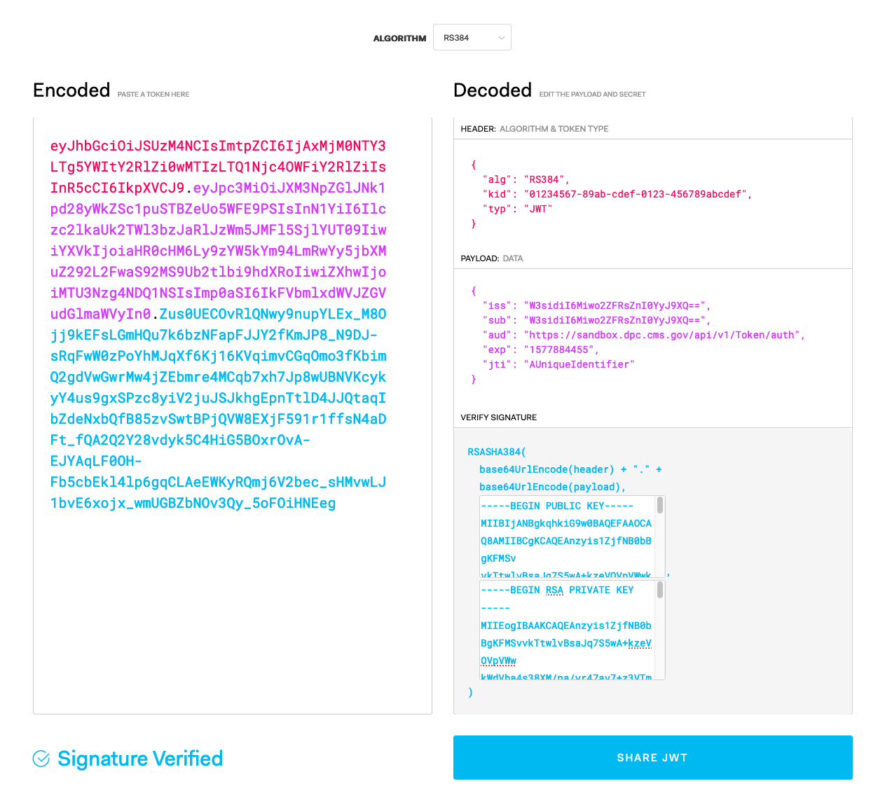

## Information on accessing and working with the API
- [Join the Data at the Point of Care Google Group](https://groups.google.com/d/forum/dpc-api)


---

As patients move throughout the healthcare system, providers often struggle to gain and maintain a complete picture of their medical history.
The Data at the Point of Care (DPC) pilot project fills in the gaps with claims data to inform providers with structured patient history, past procedures, medication adherence, and more.
This data is made available through a set of [FHIR](http://hl7.org/fhir/STU3/) compliant APIs. 

This guide serves as a starting point for users to begin working with the API by introducing the core APIs as well as two key concepts of [Bulk Data](#bulk-data) and [Patient Attribution](#attribution).

Documentation is also available in a comprehensive [OpenAPI format](/api/swagger) as well as a FHIR [implementation guide](/ig/index.html).

## Bulk Data

This project provides an implementation of the FHIR [Bulk Data Access](http://hl7.org/fhir/us/bulkdata/2019May/index.html) specification, which provides an async interface over the existing Blue Button 2.0 data model.
Details on the Blue Button data model can be found on its [project page](https://bluebutton.cms.gov).

This project will closely track changes in the underlying standard and is fully compliant with the current specification, with the following limitations:

- Type filters are not supported
- The `_since` parameter is not currently supported.
- Only `Group` level exporting is supported, not `Patient` or `System` level exports


In addition, the only available resource types are those exposed by [Blue Button](https://bluebutton.cms.gov/developers/#core-resources) which include:

- [Explanation of Benefits](https://bluebutton.cms.gov/eob/)
- [Patient](https://www.hl7.org/fhir/patient.html)
- [Coverage](http://hl7.org/fhir/coverage.html)

## Attribution

In order to receive data from the DPC application, a healthcare provider must have a treatment related purpose for viewing a patient's claims history.
Providers can attest to their treatment purposes by submitting a an *attribution roster* which lists the patients currently under their care.

In order for a provider to establish a treatment related purpose for viewing patient data, they must fulfill one of the following conditions:

1. Have an existing treatment relationship, defined as a visit or processed claim for the given patient with the provider's [National Provider Identity (NPI)](https://www.cms.gov/Regulations-and-Guidance/Administrative-Simplification/NationalProvIdentStand/) number within the past 18 months.
2. Have an upcoming appointment for the given patient within 10 days.

If neither of these conditions are met, a treatment relationship cannot be established and the provider is is **NOT** authorized to retrieve claims data.
With each roster addition or renewal, the provider is attesting that there is an active treatment relationship that creates a need for the data being requested.  

Given that existing standards for patient rosters do not exist, CMS is currently piloting an implementation of the [Attribution Guide](https://github.com/smart-on-fhir/smart-on-fhir.github.io/wiki/Bulk-data:-thoughts-on-attribution-lists-and-groups) currently under discussion with the [SMART-ON-FHIR](https://docs.smarthealthit.org/) team.
The goal is to provide feedback to the group on experiences related to implementation and supporting the recommendations.

> Note: The attribution logic and interaction flow will be subject to revision over time.
CMS welcomes [feedback on the implementation](https://groups.google.com/d/forum/dpc-api) as well as experiences with other systems.

Specific details on creating and updating treatment rosters is given in a later [section](#create-an-attribution-group).

Providers are required to keep their treatment rosters up to date, as patient attributions automatically expire after 90 days.
If an attribution expires, the provider may resubmit the patient to their roster and re-attest to a treatment purpose for another 90 days.

CMS currently restricts individual providers to no more than 5,000 attributed patients.
These restrictions are subject to change over time.

## Authentication and Authorization

The Data at the Point of Care pilot project is currently accessible as a private sandbox environment, which returns sample [NDJSON](http://ndjson.org/) files with synthetic beneficiary data.
There is no beneficiary PII or PHI in the files you can access via the sandbox.

DPC implements the *SMART Backend Services Authentication* (BSA) as described by the [SMART ON FHIR team](https://hl7.org/fhir/uv/bulkdata/authorization/index.html).
This specification requires the user to exchange their DPC provided `client_token` for an `access_token` which can be used to make API requests to the FHIR endpoints.
This exchange requires the user to submit a self-signed [JSON Web Token](https://jwt.io) using a public/private key pair that they submit to DPC either via the Web UI or the API.

> Note: Authentication is performed on a per-environment basis. Users will need to request a `client_token` and upload a public key for *each* environment they wish to access (e.g. sandbox, production, etc).

The `access_token` is then set as a **Bearer** token in the `Authorization` header for each API request.

~~~ sh
Authorization: Bearer {access_token}
~~~

**cURL command**

~~~
curl -H 'Authorization: Bearer {access_token}' {command to execute}
~~~

The authorization flow is as follows:

1. The user first submits a public key to DPC for the given environment.
This can be done either through the Web UI or via the `PublicKey` endpoint in the API.

> Note: Because the `PublicKey` endpoint is secured by BSA, the initial public key for each environment **must** be uploaded via the Web UI.
>Any additional keys can then be submitted via the API endpoints, using an existing key for signing the JWT.

2. The user creates a `client_token` to use for a given application.

3. For each API request, the user creates an `access_token` by submitting a self-signed JWT to the `/Token/auth` endpoint.

4. The user sets the provided `access_token` as a `Bearer` token in the `Authorization` header, for each request to the DPC API 

### Managing client_tokens

Client tokens are required in order to provide the ability for a given application to access the DPC API.
Details on how to create an `access_token` from a given `client_token` are given in a later [section](#creating-an-accesstoken).

#### Listing client_tokens

All client tokens registered by the organization for a given environment can be listed by making a GET request to the `/Token` endpoint.
This will return an array of objects which list the token ID, when it was created, when it expires, and the label associated with the token. 

~~~sh
GET /api/v1/Token
~~~

**cURL command**

~~~sh
curl -v https://sandbox.dpc.cms.gov/api/v1/Token \
-H 'Authorization: Bearer {access_token}' \
-H 'Accept: application/json' \
-H 'Content-Type: application/json' \
-X GET
~~~

**Response**

~~~json
{
  "created_at": "2019-11-04T11:49:55.126-05:00",
  "count": 3,
  "entities": [
    {
      "id": "3c308f6e-0223-42f8-80c2-cab242d68afc",
      "tokenType": "MACAROON",
      "label": "Token for organization 46ac7ad6-7487-4dd0-baa0-6e2c8cae76a0.",
      "createdAt": "2019-11-04T11:49:55.126-05:00",
      "expiresAt": "2020-11-04T11:49:55.095-05:00"
    },
    {
      "id": "eef87627-db4b-4c08-8a27-e88a8343099d",
      "tokenType": "MACAROON",
      "label": "Token for organization 46ac7ad6-7487-4dd0-baa0-6e2c8cae76a0.",
      "createdAt": "2019-11-04T11:50:06.101-05:00",
      "expiresAt": "2020-11-04T11:50:06.096-05:00"
    },
    {
      "id": "ea314eaa-1cf5-4d01-9ea7-1646099ca9fd",
      "tokenType": "MACAROON",
      "label": "Token for organization 46ac7ad6-7487-4dd0-baa0-6e2c8cae76a0.",
      "createdAt": "2019-11-04T11:50:06.685-05:00",
      "expiresAt": "2020-11-04T11:50:06.677-05:00"
    }
  ]
}
~~~

Specific client_tokens can be listed by making a `GET` request to the `/Token` endpoint using the unique id of the client_token.

~~~sh
GET /api/v1/Token/{client_token id}
~~~

**cURL command**

~~~sh
curl -v https://sandbox.dpc.cms.gov/api/v1/Token/{client_token id} \
-H 'Authorization: Bearer {access_token}' \
-H 'Accept: application/json' \
-H 'Content-Type: application/json' \
-X GET
~~~

**Response**

~~~json
{
    "id": "3c308f6e-0223-42f8-80c2-cab242d68afc",
    "tokenType": "MACAROON",
    "label": "Token for organization 46ac7ad6-7487-4dd0-baa0-6e2c8cae76a0.",
    "createdAt": "2019-11-04T11:49:55.126-05:00",
    "expiresAt": "2020-11-04T11:49:55.095-05:00"
}
~~~

#### Creating a client_token

Creating a `client_token` can be done by making a `POST` request to the `/Token` endpoint. 
This endpoint accepts two, optional query params:

* `label` sets a human readable label for the token. If omitted, DPC will auto-generate one.
Note, token labels are not guaranteed to be unique. 

*  `expiration` sets a custom expiration for the `client_token`.
This is provided as an [ISO formatted](https://www.iso.org/iso-8601-date-and-time-format.html) string and if omitted will default to the system specified expiration time.

> Note: The user cannot set an expiration time longer than the system allowed maximum, which is currently five minutes.
This will result in an error being returned to the user.

The response from the API includes the `client_token` in the `token` field. 

>Note: This is the _only_ time that the client token will be visible to user.
>Ensure that the value is recorded in a safe and durable location.

~~~sh
POST /api/v1/Token
~~~

**cURL command**

~~~sh
curl -v https://sandbox.dpc.cms.gov/api/v1/Token?label={token label}&expiration={ISO formatted dateTime} \
-H 'Authorization: Bearer {access_token}' \
-H 'Accept: application/json' \
-H 'Content-Type: application/json' \
-X POST
~~~

**Response**

~~~json
{
    "id": "3c308f6e-0223-42f8-80c2-cab242d68afc",
    "tokenType": "MACAROON",
    "label": "Token for organization 46ac7ad6-7487-4dd0-baa0-6e2c8cae76a0.",
    "createdAt": "2019-11-04T11:49:55.126-05:00",
    "expiresAt": "2020-11-04T11:49:55.095-05:00",
    "token:": "{client_token}"
}
~~~

#### Deleting a client_token

Client tokens can be removed by sending a `DELETE` request to the `/Token` endpoint, using the unique ID of the client_token, which is returned either on creation, or as the result of listing the client_tokens.

~~~sh
DELETE /api/v1/Token/{client_token id}
~~~

**cURL command**

~~~sh
curl -v https://sandbox.dpc.cms.gov/api/v1/Token/{client_token id} \
-H 'Authorization: Bearer {access_token}' \
-H 'Accept: application/json' \
-H 'Content-Type: application/json' \
-X DELETE
~~~

**Response**

~~~sh
200 - Token was removed
~~~

### Managing public keys

Creating an `access_token` from a given `client_token` requires that the user to submit a self-signed JWT with the specific request information (details are given in a later [section](#creating-an-accesstoken)).
In order for DPC to validate that the token request is coming from an authorized application, it verifies that the private key used to sign the JWT matches a public key previously uploaded to the system.
Users are required to maintain a list of acceptable public keys with the DPC system and management operations are described in this section.

> Note: There is no direct correlation between the number of `client_tokens` an organization has and the number of public/private key pairs.
> A keypair can be used to sign any number of client_tokens.   


#### Listing public keys

All public keys registered by the organization for the given endpoint can be listed by making a GET request to the `/Key` endpoint.
This will return an array of objects which list the public key ID, the human readable label, creation time and the PEM encoded value of the public key

~~~sh
GET /api/v1/Key
~~~

**cURL command**

~~~sh
curl -v http://localhost:3002/v1/Key \
-H 'Authorization: Bearer {access_token}' \
-H 'Accept: application/json' \
-H 'Content-Type: application/json' \
-X GET
~~~

**Response**

~~~json
{
  "created_at": "2019-11-04T13:16:29.008-05:00",
  "count": 1,
  "entities": [
    {
      "id": "b296f9d2-1aae-4c59-b6c7-c759b9db5226",
      "publicKey": "-----BEGIN PUBLIC KEY-----\nMIIBIjANBgkqhkiG9w0BAQEFAAOCAQ8AMIIBCgKCAQEAmyI+y8vAAFcV4deNdyKC\nH16ZPU7tgwnUzvtEYOp6s0DFjzgaqWmYZd/CNlb1psi+J0ChtcL9+Cx3v+HwDqVx\nToQrEqJ8hMavtXnxm2jPoRaxmbIGjHZ6jfyMot5+CdP8Vr5o9G2WIUgzjhFwMEXh\nlYg97uZadLLVKVXYTl4HtluVX5y7p1Wh4vkyJFBiqrX7qAJXvr6PK7OUeZDeVsse\nOMm33VwgbQSGRw7yWNOw+H/RbpGQkAUtHvGYvo/qLeb+iJsF2zBtjnkTmk5I8Vlo\n4xzbqaoqZqsHp4NgCw+bq0Y6AWLE2yUYi/DOatOdIBfLxlpf/FAY3f5FbNjISUuL\nmwIDAQAB\n-----END PUBLIC KEY-----\n",
      "createdAt": "2019-11-04T13:16:29.008-05:00",
      "label": "test-key"
    }
  ]
}
~~~

Specific public keys can be listed by making a `GET` request to the `/Key` endpoint using the unique id of the public key.

~~~sh
GET /api/v1/Key/{public key id}
~~~

**cURL command**

~~~sh
curl -v https://sandbox.dpc.cms.gov/api/v1/Key/{public key id} \
-H 'Authorization: Bearer {access_token}' \
-H 'Accept: application/json' \
-H 'Content-Type: application/json' \
-X GET
~~~

**Response**

~~~json
{
    "id": "b296f9d2-1aae-4c59-b6c7-c759b9db5226",
    "publicKey": "-----BEGIN PUBLIC KEY-----\nMIIBIjANBgkqhkiG9w0BAQEFAAOCAQ8AMIIBCgKCAQEAmyI+y8vAAFcV4deNdyKC\nH16ZPU7tgwnUzvtEYOp6s0DFjzgaqWmYZd/CNlb1psi+J0ChtcL9+Cx3v+HwDqVx\nToQrEqJ8hMavtXnxm2jPoRaxmbIGjHZ6jfyMot5+CdP8Vr5o9G2WIUgzjhFwMEXh\nlYg97uZadLLVKVXYTl4HtluVX5y7p1Wh4vkyJFBiqrX7qAJXvr6PK7OUeZDeVsse\nOMm33VwgbQSGRw7yWNOw+H/RbpGQkAUtHvGYvo/qLeb+iJsF2zBtjnkTmk5I8Vlo\n4xzbqaoqZqsHp4NgCw+bq0Y6AWLE2yUYi/DOatOdIBfLxlpf/FAY3f5FbNjISUuL\nmwIDAQAB\n-----END PUBLIC KEY-----\n",
    "createdAt": "2019-11-04T13:16:29.008-05:00",
    "label": "test-key"
}
~~~

#### Uploading a public key

Uploading a public key can be done by making a `POST` request to the `/Key` endpoint. 
This endpoint requires one additional query param:

* `label` sets a human readable label for the public key (this must be less than 26 characters long). 

The submitted public key must meet the following requirements:

* Be an `RSA` key (ECC keys will be supported in a future release)
* Have a key length of at least 4096 bits
* Be unique to each environment

~~~sh
POST /api/v1/Key
~~~

**cURL command**

~~~sh
curl -v https://sandbox.dpc.cms.gov/api/v1/Key?label={key label} \
-H 'Authorization: Bearer {access_token}' \
-H 'Accept: application/json' \
-H 'Content-Type: text/plain' \
-X POST \
-d "{PEM encoded public key}"
~~~

**Response**

~~~json
{
    "id": "b296f9d2-1aae-4c59-b6c7-c759b9db5226",
    "publicKey": "-----BEGIN PUBLIC KEY-----\nMIIBIjANBgkqhkiG9w0BAQEFAAOCAQ8AMIIBCgKCAQEAmyI+y8vAAFcV4deNdyKC\nH16ZPU7tgwnUzvtEYOp6s0DFjzgaqWmYZd/CNlb1psi+J0ChtcL9+Cx3v+HwDqVx\nToQrEqJ8hMavtXnxm2jPoRaxmbIGjHZ6jfyMot5+CdP8Vr5o9G2WIUgzjhFwMEXh\nlYg97uZadLLVKVXYTl4HtluVX5y7p1Wh4vkyJFBiqrX7qAJXvr6PK7OUeZDeVsse\nOMm33VwgbQSGRw7yWNOw+H/RbpGQkAUtHvGYvo/qLeb+iJsF2zBtjnkTmk5I8Vlo\n4xzbqaoqZqsHp4NgCw+bq0Y6AWLE2yUYi/DOatOdIBfLxlpf/FAY3f5FbNjISUuL\nmwIDAQAB\n-----END PUBLIC KEY-----\n",
    "createdAt": "2019-11-04T13:16:29.008-05:00",
    "label": "test-key"
}
~~~

The `id` field of the response will be used as the `kid` JWT header value, as described in a later [section](#creating-an-accesstoken)

#### Deleting a public key

Public keys can be removed by sending a `DELETE` request to the `/Key` endpoint, using the unique ID of the public key, which is returned either on creation, or as the result of listing the public keys.

~~~sh
DELETE /api/v1/Key/{public key ID}
~~~

**cURL command**

~~~sh
curl -v https://sandbox.dpc.cms.gov/api/v1/Key/{public key id} \
-H 'Authorization: Bearer {access_token}' \
-H 'Accept: application/json' \
-H 'Content-Type: application/json' \
-X DELETE
~~~

**Response**

~~~javascript
200 - Key was removed
~~~

### Creating an access_token

Creating an *access_token* for API access requires the user to submit a self-signed JWT to the `/Token/auth` endpoint.
This token must be signed with a public key previously registered and contain the following header and claim values:


**Authentication JWT Header Values**

`alg`	_required_	- Fixed value: RS384

`kid`   _required_	- The identifier of the key-pair used to sign this JWT. This must be the ID of a previously registered public key

`typ`	_required_	- Fixed value: JWT.

**Authentication JWT Claims**

`iss`	_required_	Issuer of the JWT -- the `client_token` provided by DPC

`sub`	_required_	Issuer of the JWT -- the `client_token` provided by DPC (note that this is the same as the value for the `iss` claim)

`aud`	_required_	The DPC "token URL" (the same URL to which this authentication JWT will be posted. e.g. https://dpc.cms.gov/api/v1/Token/auth)

`exp`	_required_	Expiration time integer for this authentication JWT, expressed in seconds since the "Epoch" (1970-01-01T00:00:00Z UTC). This time SHALL be no more than five minutes in the future.

`jti`	_required_	A nonce string value that uniquely identifies this authentication JWT.

#### Creating a JSON Web Token (JWT)
[JWT.io](https://jwt.io/) provides comprehensive information about what JSON Web Tokens are and how to use them.  For testing purposes, the site offers a [debugger](https://jwt.io/#debugger-io) that allows you to enter a header, payload, and keys to generate a signed JWT.

Online tools for creating JWTs **should not** be considered secure and **should not** be used to create tokens to access production data. Instead, use one of the [libraries](https://jwt.io/#libraries-io) listed on JWT.io to generate JWTs in your DPC API client.

##### JWT for testing in the sandbox
For the DPC sandbox environment, which contains no PII or PHI, a JWT can be created with the [JWT.io debugger](https://jwt.io/#debugger-io). More details on each field can be found under [Authentication JWT Header Values](#authentication-jwt-header-values) and [Authentication JWT Claims](#authentication-jwt-claims).
1. From the Algorithm dropdown, select `RS384`.
1. On the "Decoded" side, the "Header: Algorithm & Token Type" text area must contain a JSON object with the fields below. `alg` and `typ` will already be set, so you will need to add `kid`.
   1. `"alg": "RS384"` (set for you after you select the algorithm)
   1. `"kid": "{ID of public key}"`
   1. `"typ": "JWT"` (set by default)
1. The "Payload: Data" text area must contain a JSON object with the fields below. It will already contain `sub`, `name`, `admin`, and `iat`. The value of `sub` will change, and `name`, `admin`, and `iat` should be removed.
   1. `"iss": "{client token}"`
   1. `"sub": "{client token}"`
   1. `"aud": "https://sandbox.dpc.cms.gov/api/v1/Token/auth"`
   1. `"exp": "{expiration time}"`
   1. `"jti": "{nonce}"`
1. Under "Verify Signature", the first text area should contain your public key, and the second, your private key. This keypair should be for testing in the sandbox, not one that is used to access any production data.



##### JWT for production use
JWT.io's debugger **should not** be used to create tokens for accessing the production environment. JWTs can be created by your DPC client using one of the many [JWT libraries](https://jwt.io/#libraries-io) in a variety of programming languages. For example, Auth0 has created a [Java library](https://github.com/auth0/java-jwt), and its [README](https://github.com/auth0/java-jwt#usage) shows you how to implement it to create your own tokens.

#### Validating a DPC token
The DPC API supports a `/Token/validate` endpoint, which allows the user to submit their signed JWT for validation.
This will return an error message with details as to which claims or values on the JWT are missing or incorrect.
This method *DOES NOT* validate the JWT signature, public key or client tokens, it merely verifies the necessary elements are present in the JWT entity.

~~~sh
POST /api/v1/Token/validate
~~~

**cURL command**

~~~sh
curl -v https://sandbox.dpc.cms.gov/api/v1/Token/validate \
-H 'Accept: application/json' \
-H 'Content-Type: text/plain' \
-X POST \
-d "{Signed JWT}"
~~~

In order to receive an `access_token` the JWT is submitted to the `/Token/auth` endpoint as the `client_assertion` query param of an `application/x-www-form-urlencoded` POST request, along with the following, additional, query params:

**Parameters**

`scope`	                _required_	The scope of access requested. (Currently, the only supported scope is `system/*.*`)

`grant_type`            _required_	Fixed value: `client_credentials`

`client_assertion_type`	_required_	Fixed value: `urn:ietf:params:oauth:client-assertion-type:jwt-bearer`

`client_assertion`  	_required_	Signed authentication JWT value (see above)

The endpoint response is a JSON object which contains the access_token, the lifetime of the token (in seconds) and the authorized system scopes.

~~~sh
POST /api/v1/Token/auth
~~~

**cURL command**

~~~sh
curl -v "https://sandbox.dpc.cms.gov/api/v1/Token/auth?grant_type=client_credentials&scope=system%2F*.*&client_assertion_type=urn%3Aietf%3Aparams%3Aoauth%3Aclient-assertion-type%3Ajwt-bearer&client_assertion={self-signed JWT}" \
-H 'Content-Type: application/x-www-form-urlencoded' \
-H 'Accept: application/json' \
-X POST
~~~

**Response**

~~~json
{
  "access_token": "{access_token value}",
  "token_type": "bearer",
  "expires_in": 300,
  "scope": "system/*.*"
}
~~~ 

## Environment
The examples below include cURL commands, but may be followed using any tool that can make HTTP GET requests with headers, such as [Postman](https://getpostman.com).

> Note: DPC sandbox environments do not have any test data loaded.
> Users will need to provide their own FHIR resources in order to use the Sandbox. Details on finding sample data is given in a later [section](#sample-data).
>

### Examples

Examples are shown as requests to the DPC sandbox environment.
Any resource Identifiers that are show are merely examples and cannot be used as actual requests to the DPC sandbox.

Be sure to include the CMS generated Access token in the requests, as documented in the [Authorization](#authentication-and-authorization) section.

## DPC Metadata

Metadata about the Data at the Point of Care (DPC) pilot project is available as a FHIR [CapabilityStatement](http://hl7.org/fhir/STU3/capabilitystatement.html) resource.

~~~ sh
GET /api/v1/metadata
~~~

**cURL command**

~~~sh
curl https://sandbox.dpc.cms.gov/api/v1/metadata
~~~


**Response**

~~~ json
{
  "resourceType": "CapabilityStatement",
  "description": "This Capability Statement defines the available resource, endpoints and operations supported by the Data @ the Point of Care Application.",
  "id": "dpc-capabilities",
  "version": "0.3.0-SNAPSHOT",
  "status": "draft",
  "date": "2019",
  "publisher": "Centers for Medicare and Medicaid Services",
  "kind": "capability",
  "instantiates": [
    "http://build.fhir.org/ig/HL7/bulk-data/CapabilityStatement-bulk-data"
  ],
  "software": {
    "name": "Data @ Point of Care API",
    "version": "0.3.0-SNAPSHOT",
    "releaseDate": "2019"
  },
  "fhirVersion": "3.0.1",
  "acceptUnknown": "extensions",
  "format": [
    "application/json",
    "application/fhir+json"
  ],
  "rest": [
    {
      "mode": "server",
      "resource": [
        {
          "type": "Endpoint",
          "profile": {
            "reference": "https://dpc.cms.gov/api/v1/StructureDefinition/dpc-profile-endpoint"
          },
          "interaction": [
            {
              "code": "read"
            },
            {
              "code": "search-type"
            }
          ],
          "versioning": "no-version"
        },
        {
          "type": "Organization",
          "profile": {
            "reference": "https://dpc.cms.gov/api/v1/StructureDefinition/dpc-profile-organization"
          },
          "interaction": [
            {
              "code": "read"
            }
          ],
          "versioning": "no-version"
        },
        {
          "type": "Patient",
          "profile": {
            "reference": "https://dpc.cms.gov/api/v1/StructureDefinition/dpc-profile-patient"
          },
          "interaction": [
            {
              "code": "read"
            },
            {
              "code": "create"
            },
            {
              "code": "update"
            },
            {
              "code": "delete"
            },
            {
              "code": "search-type"
            }
          ],
          "versioning": "no-version",
          "searchParam": [
            {
              "name": "identifier",
              "type": "string"
            }
          ]
        },
        {
          "type": "Practitioner",
          "profile": {
            "reference": "https://dpc.cms.gov/api/v1/StructureDefinition/dpc-profile-practitioner"
          },
          "interaction": [
            {
              "code": "read"
            },
            {
              "code": "create"
            },
            {
              "code": "update"
            },
            {
              "code": "delete"
            },
            {
              "code": "search-type"
            }
          ],
          "versioning": "no-version",
          "searchParam": [
            {
              "name": "identifier",
              "type": "string"
            }
          ]
        },
        {
          "type": "StructureDefinition",
          "interaction": [
            {
              "code": "read"
            },
            {
              "code": "search-type"
            }
          ],
          "versioning": "no-version"
        }
      ],
      "interaction": [
        {
          "code": "batch"
        }
      ],
      "operation": [
        {
          "name": "Group level data export",
          "definition": {
            "reference": "http://build.fhir.org/ig/HL7/bulk-data/OperationDefinition-group-export"
          }
        }
      ]
    }
  ]
}
~~~

## Attributing Patients to Providers

In order to export data from the DPC application, a healthcare provider must have attributed [Patient](https://hl7.org/fhir/STU3/patient.html) resources.
This attribution assertion attests to CMS that the provider has a treatment related purpose for accessing patient information.
More details on the attribution logic and rules are given [earlier](#attribution) in this reference.

### Sample data

As previously mentioned, the DPC sandbox environments do not have any pre-loaded test data.
Users will need to provide their own FHIR resources in order to successfully make export requests to the Blue Button backend.

The DPC team has created a collection of sample Patient and Practitioner resources which can be used to get started with the sandbox.
The files are available in our public [GitHub](https://github.com/CMSgov/dpc-app/tree/master/src/main/resources) repository.
More details are given in the included [README](https://github.com/CMSgov/dpc-app/blob/master/src/main/resources/README.md) file.

The sample data was generated using the excellent [Synthea](https://synthea.mitre.org) project, with some modifications that are documented in the repository. 

Users can provide any sample FHIR resources (that fulfill the required FHIR profiles) to DPC, but will need to ensure that, for the sandbox environments, any `Patient` resources have an *Medicare Beneficiary Identifier* (MBI) that matches a record in the Blue Button backend.

The Blue Button team maintains a list of beneficiaries (along with their MBIs) that can be used for matching existing synthetic data (such as from an organization's training EMR) with valid sandbox MBIs.
More details and the corresponding data files can be found [here](https://bluebutton.cms.gov/developers/#sample-beneficiaries).

### Create a Provider

An organization must first create a [Practitioner](http://hl7.org/fhir/STU3/practitioner.html) resource, which represents a healthcare provider that is associated with the organization.
This is accomplished by executing a `POST` request against the `Practitioner` resource, with the body containing a FHIR Practitioner resource.

~~~sh
POST /api/v1/Practitioner
~~~

Details on the exact data format are given in the [implementation guide](https://dpc.cms.gov/ig/StructureDefinition-dpc-profile-practitioner.html) but at a minimum, each resource must include:

- The [NPI](https://www.cms.gov/Regulations-and-Guidance/Administrative-Simplification/NationalProvIdentStand/) of the provider
- The provider's first and last name

**cURL command**

~~~sh
curl -v https://sandbox.dpc.cms.gov/api/v1/Practitioner
-H 'Authorization: Bearer {access_token}' \
-H 'Accept: application/fhir+json' \
-H 'Content-Type: application/fhir+json' \
-X POST \
-d @provider.json
~~~

**provider.json**

~~~json
{
  "meta": {
    "profile": [
      "https://dpc.cms.gov/api/v1/StructureDefinition/dpc-profile-practitioner"
    ],
    "lastUpdated": "2019-04-09T12:25:36.450182+00:00",
    "versionId": "MTU1NDgxMjczNjQ1MDE4MjAwMA"
  },
  "resourceType": "Practitioner",
  "id": "0c527d2e-2e8a-4808-b11d-0fa06baf8254",
  "identifier": [
    {
      "system": "http://hl7.org/fhir/sid/us-npi",
      "value": "3116145044854423862"
    }
  ],
  "address": [
    {
      "city": "PLYMOUTH",
      "country": "US",
      "line": [
        "275 SANDWICH STREET"
      ],
      "postalCode": "02360",
      "state": "MA"
    }
  ],
  "gender": "male",
  "name": [
    {
      "family": "Klocko335",
      "given": [
        "Leonard963"
      ],
      "prefix": [
        "Dr."
      ]
    }
  ]
}
~~~

The `Practitioner.identifier` value of the returned resource can be used in the attribution group created in a later [section](#create-an-attribution-group).

The `Practitioner` endpoint also supports a `$submit` operation, which allows the user to upload a [Bundle](https://www.hl7.org/fhir/STU3/bundle.html) of resources for registration in a single batch operation.

Each `Practioner` resource in the Bundle *MUST* satisfy the [dpc-practitioner](https://dpc.cms.gov/ig/StructureDefinition-dpc-profile-practitioner.html) profile, otherwise a `422 - Unprocessable Entity` error will be returned.

~~~sh
POST /api/v1/Practitioner/$submit
~~~

**cURL command**

~~~sh
curl -v https://sandbox.dpc.cms.gov/api/v1/Practitioner/\$submit
-H 'Authorization: Bearer {access_token}' \
-H 'Accept: application/fhir+json' \
-H 'Content-Type: application/fhir+json' \
-X POST \
-d @provider_bundle.json
~~~

**provider_bundle.json**

~~~javascript
{
    "resourceType": "Parameters",
    "parameter": [{
        "name": "resource",
        "resource": {
                      "resourceType": "Bundle",
                      "type": "collection",
                      "entry": [
                        {
                          "resource": {
                            "resourceType": "Practitioner",
                            ... Omitted for Brevity ...
                          }
                        }
                      ]
                    }
       
    }]
}
~~~


### Create a Patient

The organization is also required to maintain a list of [Patient](http://hl7.org/fhir/STU3/patient.html) resources which represent the patient population currently being treated by their facilities.


~~~sh
POST /api/v1/Patient
~~~

Details on the exact data format are given in the [implementation guide](https://dpc.cms.gov/ig/StructureDefinition-dpc-profile-patient.html) but at a minimum, each resource must include:

- The MBI of the patient
- The patient's first and last name
- The patient's birthdate

> Note: The Blue Button team is currently in the process of implementing support for MBIs in accordance with CMS policies.
>
>In the interim, DPC is making use of the *Blue Button Beneficiary Identifiers* as a proxy for MBI values.
>Once MBI support is fully implemented, users will need to migrate their tooling by remapping from the **https://bluebutton.cms.gov/resources/variables/bene_id** system to the new **http://hl7.org/fhir/sid/us-mbi** system.
> Existing resources in the DPC sandbox will be automatically updated to utilize the new system.

**cURL command**

~~~sh
curl -v https://sandbox.dpc.cms.gov/api/v1/Patient
-H 'Authorization: Bearer {access_token}' \
-H 'Accept: application/fhir+json' \
-H 'Content-Type: application/fhir+json' \
-X POST \
-d @patient.json
~~~

**patient.json**

~~~json
{
  "resourceType": "Patient",
  "id": "728b270d-d7de-4143-82fe-d3ccd92cebe4",
  "meta": {
      "profile": [
        "https://dpc.cms.gov/api/v1/StructureDefinition/dpc-profile-patient"
      ],
      "lastUpdated": "2019-04-09T12:25:36.450182+00:00"
    },
  "identifier": [
    {
      "system": "https://bluebutton.cms.gov/resources/variables/bene_id",
      "value": "-20000000001809"
    }
  ],
  "name": [
    {
      "use": "official",
      "family": "Prosacco",
      "given": [
        "Jonathan"
      ],
      "prefix": [
        "Mr."
      ]
    }
  ],
  "telecom": [
    {
      "system": "phone",
      "value": "555-719-3748",
      "use": "home"
    }
  ],
  "gender": "male",
  "birthDate": "1943-06-08",
  "address": [
    {
      "extension": [
        {
          "url": "http://hl7.org/fhir/StructureDefinition/geolocation",
          "extension": [
            {
              "url": "latitude",
              "valueDecimal": 42.187011
            },
            {
              "url": "longitude",
              "valueDecimal": -71.30040
            }
          ]
        }
      ],
      "line": [
        "1038 Ratke Throughway Apt 10"
      ],
      "city": "Medfield",
      "state": "Massachusetts",
      "postalCode": "02052",
      "country": "US"
    }
  ],
  "maritalStatus": {
    "coding": [
      {
        "system": "http://hl7.org/fhir/v3/MaritalStatus",
        "code": "M",
        "display": "Married"
      }
    ],
    "text": "M"
  },
  "multipleBirthBoolean": false,
  "communication": [
    {
      "language": {
        "coding": [
          {
            "system": "urn:ietf:bcp:47",
            "code": "en-US",
            "display": "English (Region=United States)"
          }
        ],
        "text": "English"
      }
    }
  ]
}
~~~


The `Patient.id` value of the returned resource can be used in the attribution group created in a later [section](#create-an-attribution-group).

The `Patient` endpoint also supports a `$submit` operation, which allows the user to upload a [Bundle](https://www.hl7.org/fhir/STU3/bundle.html) of resources for registration in a single batch operation.

Each `Patient` resource in the Bundle *MUST* satisfy the [dpc-patient](https://dpc.cms.gov/ig/StructureDefinition-dpc-profile-patient.html) profile, otherwise a `422 - Unprocessable Entity` error will be returned.

~~~sh
POST /api/v1/Patient/$submit
~~~

**cURL command**

~~~sh
curl -v https://sandbox.dpc.cms.gov/api/v1/Patient/\$submit
-H 'Authorization: Bearer {access_token}' \
-H 'Accept: application/fhir+json' \
-H 'Content-Type: application/fhir+json' \
-X POST \
-d @patient_bundle.json
~~~

**patient_bundle.json**

~~~javascript
{
  "resourceType": "Parameters",
  "parameter": [
    {
      "name": "resource",
      "resource": {
        "resourceType": "Bundle",
        "type": "collection",
        "entry": [
          {
            "resource": {
              "resourceType": "Patient",
              ... Omitted for Brevity ...
            }
          }
        ]
      }
    }
  ]
}
~~~

### Create attestation record for data release

CMS requires that the provider attest they have a treatment related purpose for adding a patient to their roster **each** time they make a roster addition.
This is accomplished by submitting a `Provenance` resource via the `X-Provenance` header, as outlined in the FHIR specification.

Details on the exact data format are given in the [implementation guide](/ig/index.html) but at a minimum, each attestation must include:

- A timestamp of when the attestation is made.
- The reason for the attestation (currently only: `http://hl7.org/fhir/v3/ActReason#TREAT` is supported).
- The agent making the attestation (identified by their Organization resource ID) on behalf of a given provider (identified by their resource ID).

**Example attestation**

```javascript
{
  "resourceType": "Provenance",
  "meta": {
    "profile": [
      "https://dpc.cms.gov/api/v1/StructureDefinition/dpc-profile-attestation"
    ]
  },
  "recorded": "1990-01-01T00:00:00.000-05:00",
  "reason": [
    {
      "system": "http://hl7.org/fhir/v3/ActReason",
      "code": "TREAT"
    }
  ],
  "agent": [
    {
      "role": [
        {
          "coding": [
            {
              "system": "http://hl7.org/fhir/v3/RoleClass",
              "code": "AGNT"
            }
          ]
        }
      ],
      "whoReference": {
        "reference": "Organization/{organization ID}"
      },
      "onBehalfOfReference": {
        "reference": "Practitioner/{practitioner ID}"
      }
    }
  ]
}
```

The provenance resource is then included in the `X-Provenance` header as part of any `/Group` operations which add patients to a given roster.

### Create an Attribution Group

Once the Provider and Patient records have been created, the final step is to associate the records into an attribution [Group](http://hl7.org/fhir/STU3/patient.html) resource, also known as a Patient roster.

Details on the exact data format are given in the [implementation guide](/ig/index.html) but at a minimum, each resource must include:

- A list of `Patient` references
- The NPI of the provider which the patients are being attributed to

~~~sh
POST /api/v1/Group
~~~

**cURL command**

~~~sh
curl -v https://sandbox.dpc.cms.gov/api/v1/Group
-H 'Authorization: Bearer {access_token}' \
-H 'Accept: application/fhir+json' \
-H 'Content-Type: application/fhir+json' \
-H 'X-Provenance: {FHIR provenance resource} \
-X POST \
-d @group.json
~~~

**group.json**

~~~ json
{
  "resourceType": "Group",
  "type": "person",
  "actual": true,
  "characteristic": [
    {
      "code": {
        "coding": [
          {
            "code": "attributed-to"
          }
        ]
      },
      "valueCodeableConcept": {
        "coding": [
          {
            "system": "http://hl7.org/fhir/sid/us-npi",
            "code": "110001029483"
          }
        ]
      }
    }
  ],
  "member": [
    {
      "entity": {
        "reference": "Patient/4d72ad76-fbc6-4525-be91-7f358f0fea9d"
      }
    },
    {
      "entity": {
        "reference": "Patient/74af8018-f3a1-469c-9bfa-1dfd8a646874"
      }
    }
  ]
}
~~~

**Attribution Response**

~~~ json
{
  "resourceType": "Group",
  "type": "person",
  "actual": true,
  "characteristic": [
    {
      "code": {
        "coding": [
          {
            "code": "attributed-to"
          }
        ]
      },
      "valueCodeableConcept": {
        "coding": [
          {
            "system": "http://hl7.org/fhir/sid/us-npi",
            "code": "110001029483"
          }
        ]
      }
    }
  ],
  "member": [
    {
      "entity": {
        "reference": "Patient/4d72ad76-fbc6-4525-be91-7f358f0fea9d"
      },
      "period": {
        "start": "2019-10-30T14:00:30+00:00",
        "end": "2020-01-28T14:00:53+00:00"
      },
      "inactive": false
    },
    {
      "entity": {
        "reference": "Patient/74af8018-f3a1-469c-9bfa-1dfd8a646874"
      },
      "period": {
        "start": "2019-10-30T14:00:30+00:00",
        "end": "2020-01-28T14:00:53+00:00"
      },
      "inactive": false
    }
  ]
}
~~~

The `Group` response returned by DPC includes additional `period` and `inactive` elements for each member, which indicate the time period for which the patient is active on the provider's roster, or, if the relationship has expired, the time period for which the patient *was* active on the roster.
When an attribution relationship between a patient and provider has expired, either due to exceeding the 90 day threshold or being manually removed. The `inactive` flag will be set to `true` for the given patient.
Patient's which are listed on a provider's roster but have their `inactive` flag set to `true` will not be included in Bulk Data exports.

The `Group.id` value of the returned resource can be used by the client to initiate an [export job](#exporting-data).

### Update an Attribution Group

Patient attribution relationships automatically expire after 90 days and must be re-attested by the provider.
This is accomplished by resubmitting the patient to the provider's attribution Group.

#### Adding patients to roster

Roster additions are handled through a custom `$add` operation on the *Group* endpoint.
This takes the members listed into given resource and adds them to the existing attribution list. 

~~~sh
POST /api/v1/Group/{Group.id}/$add
~~~

**cURL command**

~~~sh
curl -v https://sandbox.dpc.cms.gov/api/v1/Group/{Group.id}/\$add
-H 'Authorization: Bearer {access_token}' \
-H 'Accept: application/fhir+json' \
-H 'X-Provenance: {FHIR provenance resource} \
-X POST \
-d @group_addition.json
~~~

**updated_group.json**

~~~json
"resource": {
        "resourceType": "Group",
        "type": "person",
        "actual": true,
        "characteristic": [{
          "code": {
            "coding": [
              {
                "code": "attributed-to"
              }
            ]
          },
          "valueCodeableConcept": {
            "coding": [
              {
                "system": "http://hl7.org/fhir/sid/us-npi",
                "code": "110001029483"
              }
            ]
          }
        }],
        "member": [
          {
            "entity": {
              "reference": "Patient/bb151edf-a8b5-4f5c-9867-69794bcb48d1"
            }
           }
        ]
      }
~~~


#### Removing patients from a roster

Roster removals are handled through a custom `remove` operation on the *Group* endpoint.
This takes the members listed into given resource and removes them from the existing attribution list.

~~~sh
POST /api/v1/Group/{Group.id}/$remove
~~~

**cURL command**

~~~sh
curl -v https://sandbox.dpc.cms.gov/api/v1/Group/{Group.id}/\$remove
-H 'Authorization: Bearer {access_token}' \
-H 'Accept: application/fhir+json' \
-X POST \
-d @group_removal.json
~~~

**group_removal.json**

~~~json
"resource": {
        "resourceType": "Group",
        "type": "person",
        "actual": true,
        "characteristic": [{
          "code": {
            "coding": [
              {
                "code": "attributed-to"
              }
            ]
          },
          "valueCodeableConcept": {
            "coding": [
              {
                "system": "http://hl7.org/fhir/sid/us-npi",
                "code": "110001029483"
              }
            ]
          }
        }],
        "member": [
          {
              "entity": {
                "reference": "Patient/4d72ad76-fbc6-4525-be91-7f358f0fea9d"
              },
            },
        ]
      }
~~~


#### Replacing roster membership

Users can also submit a `Group` resource which completely replaces the existing attribution roster.
This results in the current group membership being *completely* replaced with the members listed in the given resource.
This endpoint does *not* merge with the existing membership state, it completely replaces whatever currently exists.

~~~sh
PUT /api/v1/Group/{Group.id}
~~~

**cURL command**

~~~sh
curl -v https://sandbox.dpc.cms.gov/api/v1/Group/{Group.id}
-H 'Authorization: Bearer {access_token}' \
-H 'Accept: application/fhir+json' \
-H 'X-Provenance: {FHIR provenance resource} \
-X PUT \
-d @updated_group.json
~~~

**updated_group.json**

~~~json
"resource": {
        "resourceType": "Group",
        "type": "person",
        "actual": true,
        "characteristic": [{
          "code": {
            "coding": [
              {
                "code": "attributed-to"
              }
            ]
          },
          "valueCodeableConcept": {
            "coding": [
              {
                "system": "http://hl7.org/fhir/sid/us-npi",
                "code": "110001029483"
              }
            ]
          }
        }],
        "member": [
          {
            "entity": {
              "reference": "Patient/4d72ad76-fbc6-4525-be91-7f358f0fea9d"
            },
          },
          {
            "entity": {
              "reference": "Patient/bb151edf-a8b5-4f5c-9867-69794bcb48d1"
            }
           }
        ]
      }
~~~

## Exporting data

The primary interaction with the DPC pilot is via the FHIR `$export` operation.
This allows an organization to export data for their providers in an asynchronous and bulk manner.
Details on the operation itself can be found in the [FHIR Bulk Data Specification](https://build.fhir.org/ig/HL7/bulk-data/OperationDefinition-group-export.html).

Steps for creating and monitoring an export job are given in this section.


**1. Obtain an access token**

See the [Authentication and Authorization](#authentication-and-authorization) section above.

**2. Find the Provider Group**

Lookup the attribution [Group](https://hl7.org/fhir/STU3/group.html) resource associated to a specific provider using their [National Provider Identity (NPI)](https://www.cms.gov/Regulations-and-Guidance/Administrative-Simplification/NationalProvIdentStand/) number.
Creating attribution groups is covered in an earlier [section](#attributing-patients-to-providers).

> Note: DPC supports the standard FHIR search protocol, detailed [here](https://www.hl7.org/fhir/search.html).
>Searching for rosters associated to a given provider makes use of [composite search parameters](https://www.hl7.org/fhir/search.html#combining). 

~~~ sh
GET /api/v1/Group?characteristic-value=|attributed-to$|{provider NPI}
~~~

**cURL command**

~~~ sh
curl -v https://sandbox.dpc.cms.gov/api/v1/Group?characteristic=attributed-to&characteristic-code={provider NPI} \
-H 'Authorization: Bearer {access_token}' \
-H 'Accept: application/fhir+json
~~~

This returns a [Bundle](https://hl7.org/fhir/STU3/bundle.html) resource which contains the attribution groups for the given provider.

**Response**

~~~ json
{
  "resourceType": "Bundle",
  "type": "searchset",
  "total": 1,
  "entry": [
    {
      "resource": {
        "resourceType": "Group",
        "id": "64d0cd85-7767-425a-a3b8-dcc9bdfd5402",
        "type": "person",
        "actual": true,
        "characteristic": {
          "code": {
            "coding": [
              {
                "code": "attributed-to"
              }
            ]
          },
          "valueCodeableConcept": {
            "coding": [
              {
                "system": "http://hl7.org/fhir/sid/us-npi",
                "code": "{provider NPI}"
              }
            ]
          }
        },
        "member": [
          {
            "entity": {
              "reference": "Patient/4d72ad76-fbc6-4525-be91-7f358f0fea9d"
            }
          },
          {
            "entity": {
              "reference": "Patient/74af8018-f3a1-469c-9bfa-1dfd8a646874"
            }
          }
        ]
      }
    }
  ]
}
~~~

Using the `Group.id` value of the returned resources a client can initiate an export job.   

**3. Initiate an export job**

~~~ sh
GET /api/v1/Group/{attribution group ID}/$export
~~~

To start an explanation of benefit data export job, a GET request is made to the ExplanationOfBenefit export endpoint.
An access token as well as Accept and Prefer headers are required.

The dollar sign (‘$’) before the word “export” in the URL indicates that the endpoint is an action rather than a resource. The format is defined by the FHIR Bulk Data Export spec.

**Headers**

- Authorization: Bearer {access_token}
- Accept: `application/fhir+json`
- Prefer: `respond-async`

**cURL command**

~~~ sh
curl -v https://sandbox.DPC.cms.gov/api/v1/Group/{attribution Group.id}/\$export \
-H 'Authorization: Bearer {access_token}' \
-H 'Accept: application/fhir+json' \
-H 'Prefer: respond-async'
~~~

**Response**

If the request was successful, a `202 Accepted` response code will be returned and the response will include a `Content-Location` header.
The value of this header indicates the location to check for job status and outcome.
In the example header below, the number `42` in the URL represents the ID of the export job.

**Headers**

- Content-Location: https://sandbox.dpc.cms.gov/api/v1/Jobs/{unique ID of export job}


**4. Check the status of the export job**

> Note: The `Job` endpoint is not a FHIR resource and does not require the `Accept` header to be set to `application/fhir+json`.

**Request**

~~~ sh
GET https://sandbox.dpc.cms.gov/api/v1/Jobs/{unique ID of export job}
~~~

Using the `Content-Location` header value from the data export response, you can check the status of the export job.
The status will change from `202 Accepted` to `200 OK` when the export job is complete and the data is ready to be downloaded.

**Headers**

- Authorization: Bearer {access_token}

**cURL Command**

~~~ sh
curl -v https://sandbox.dpc.cms.gov/api/v1/Jobs/{unique ID of export job} \
-H 'Authorization: Bearer {access_token}'
~~~

**Responses**

- `202 Accepted` indicates that the job is processing. Headers will include `X-Progress: In Progress`
- `200 OK` indicates that the job is complete. Below is an example of the format of the response body.

~~~ json
{
"transactionTime": "2018-10-19T14:47:33.975024Z",
"request": "https://sandbox.dpc.cms.gov/api/v1/Group/64d0cd85-7767-425a-a3b8-dcc9bdfd5402/$export",
"requiresAccessToken": true,
"output": [
  {
    "type": "ExplanationOfBenefit",
    "url": "https://sandbox.dpc.cms.gov/api/v1/data/42/DBBD1CE1-AE24-435C-807D-ED45953077D3.ndjson",
    "extension": [
        {
            "url": "https://dpc.cms.gov/checksum",
            "valueString": "sha256:8b74ba377554fa73de2a2da52cab9e1d160550247053e4d6aba1968624c67b10"
        },
        {
            "url": "https://dpc.cms.gov/file_length",
            "valueDecimal": 2468
        }
    ]
  }
],
"error": [
  {
    "type": "OperationOutcome",
    "url": "https://sandbox.dpc.cms.gov/api/v1/data/42/DBBD1CE1-AE24-435C-807D-ED45953077D3-error.ndjson"
  }
]
}
~~~

Claims data can be found at the URLs within the output field. The output includes file integrity information in an `extension` array. It contains `https://dpc.cms.gov/checksum`, a checksum in the format `algorithm:checksum`, and `https://dpc.cms.gov/file_length`, the file length in bytes.
The number `42` in the data file URLs is the same job ID from the Content-Location header URL in previous step.
If some of the data cannot be exported due to errors, details of the errors can be found at the URLs in the error field.
The errors are provided in [NDJSON](http://ndjson.org/) files as FHIR [OperationOutcome](http://hl7.org/fhir/STU3/operationoutcome.html) resources.

**5. Retrieve the NDJSON output file(s)**

> Note: The `Data` endpoint is not a FHIR resource and doesn't require the `Accept` header to be set to `application/fhir+json`.

To obtain the exported explanation of benefit data, a GET request is made to the output URLs in the job status response when the job reaches the Completed state. The data will be presented as an [NDJSON](http://ndjson.org/) file of ExplanationOfBenefit resources.

**Request**

~~~ sh
GET https://sandbox.dpc.cms.gov/api/v1/data/42/DBBD1CE1-AE24-435C-807D-ED45953077D3.ndjson
~~~

**Headers**

- Authorization: Bearer {access_token}

**cURL command**

~~~sh
curl https://sandbox.dpc.cms.gov/api/v1/data/42/DBBD1CE1-AE24-435C-807D-ED45953077D3.ndjson \
-H 'Authorization: Bearer {access_token}'
~~~

**Response**

An example resource is shown below.

~~~ json
{
  "status":"active",
  "diagnosis":[
    {
      "diagnosisCodeableConcept":{
        "coding":[
          {
            "system":"http://hl7.org/fhir/sid/icd-9-cm",
            "code":"2113"
          }
        ]
      },
      "sequence":1,
      "type":[
        {
          "coding":[
            {
              "system":"https://bluebutton.cms.gov/resources/codesystem/diagnosis-type",
              "code":"principal",
              "display":"The single medical diagnosis that is most relevant to the patient's chief complaint or need for treatment."
            }
          ]
        }
      ]
    }
  ],
  "id":"carrier-10300336722",
  "payment":{
    "amount":{
      "system":"urn:iso:std:iso:4217",
      "code":"USD",
      "value":250.0
    }
  },
  "resourceType":"ExplanationOfBenefit",
  "billablePeriod":{
    "start":"2000-10-01",
    "end":"2000-10-01"
  },
  "extension":[
    {
      "valueMoney":{
        "system":"urn:iso:std:iso:4217",
        "code":"USD",
        "value":0.0
      },
      "url":"https://bluebutton.cms.gov/resources/variables/prpayamt"
    },
    {
      "valueIdentifier":{
        "system":"https://bluebutton.cms.gov/resources/variables/carr_num",
        "value":"99999"
      },
      "url":"https://bluebutton.cms.gov/resources/variables/carr_num"
    },
    {
      "valueCoding":{
        "system":"https://bluebutton.cms.gov/resources/variables/carr_clm_pmt_dnl_cd",
        "code":"1",
        "display":"Physician/supplier"
      },
      "url":"https://bluebutton.cms.gov/resources/variables/carr_clm_pmt_dnl_cd"
    }
  ],
  "type":{
    "coding":[
      {
        "system":"https://bluebutton.cms.gov/resources/variables/nch_clm_type_cd",
        "code":"71",
        "display":"Local carrier non-durable medical equipment, prosthetics, orthotics, and supplies (DMEPOS) claim"
      },
      {
        "system":"https://bluebutton.cms.gov/resources/codesystem/eob-type",
        "code":"CARRIER"
      },
      {
        "system":"http://hl7.org/fhir/ex-claimtype",
        "code":"professional",
        "display":"Professional"
      },
      {
        "system":"https://bluebutton.cms.gov/resources/variables/nch_near_line_rec_ident_cd",
        "code":"O",
        "display":"Part B physician/supplier claim record (processed by local carriers; can include DMEPOS services)"
      }
    ]
  },
  "patient":{
    "reference":"Patient/20000000000001"
  },
  "identifier":[
    {
      "system":"https://bluebutton.cms.gov/resources/variables/clm_id",
      "value":"10300336722"
    },
    {
      "system":"https://bluebutton.cms.gov/resources/identifier/claim-group",
      "value":"44077735787"
    }
  ],
  "insurance":{
    "coverage":{
      "reference":"Coverage/part-b-20000000000001"
    }
  },
  "item":[
    {
      "locationCodeableConcept":{
        "extension":[
          {
            "valueCoding":{
              "system":"https://bluebutton.cms.gov/resources/variables/prvdr_state_cd",
              "code":"99",
              "display":"With 000 county code is American Samoa; otherwise unknown"
            },
            "url":"https://bluebutton.cms.gov/resources/variables/prvdr_state_cd"
          },
          {
            "valueCoding":{
              "system":"https://bluebutton.cms.gov/resources/variables/prvdr_zip",
              "code":"999999999"
            },
            "url":"https://bluebutton.cms.gov/resources/variables/prvdr_zip"
          },
          {
            "valueCoding":{
              "system":"https://bluebutton.cms.gov/resources/variables/carr_line_prcng_lclty_cd",
              "code":"99"
            },
            "url":"https://bluebutton.cms.gov/resources/variables/carr_line_prcng_lclty_cd"
          }
        ],
        "coding":[
          {
            "system":"https://bluebutton.cms.gov/resources/variables/line_place_of_srvc_cd",
            "code":"99",
            "display":"Other Place of Service. Other place of service not identified above."
          }
        ]
      },
      "service":{
        "coding":[
          {
            "system":"https://bluebutton.cms.gov/resources/codesystem/hcpcs",
            "code":"45384",
            "version":"0"
          }
        ]
      },
      "extension":[
        {
          "valueCoding":{
            "system":"https://bluebutton.cms.gov/resources/variables/carr_line_mtus_cd",
            "code":"3",
            "display":"Services"
          },
          "url":"https://bluebutton.cms.gov/resources/variables/carr_line_mtus_cd"
        },
        {
          "valueQuantity":{
            "value":1
          },
          "url":"https://bluebutton.cms.gov/resources/variables/carr_line_mtus_cnt"
        }
      ],
      "servicedPeriod":{
        "start":"2000-10-01",
        "end":"2000-10-01"
      },
      "quantity":{
        "value":1
      },
      "category":{
        "coding":[
          {
            "system":"https://bluebutton.cms.gov/resources/variables/line_cms_type_srvc_cd",
            "code":"2",
            "display":"Surgery"
          }
        ]
      },
      "sequence":1,
      "diagnosisLinkId":[
        2
      ],
      "adjudication":[
        {
          "category":{
            "coding":[
              {
                "system":"https://bluebutton.cms.gov/resources/codesystem/adjudication",
                "code":"https://bluebutton.cms.gov/resources/variables/carr_line_rdcd_pmt_phys_astn_c",
                "display":"Carrier Line Reduced Payment Physician Assistant Code"
              }
            ]
          },
          "reason":{
            "coding":[
              {
                "system":"https://bluebutton.cms.gov/resources/variables/carr_line_rdcd_pmt_phys_astn_c",
                "code":"0",
                "display":"N/A"
              }
            ]
          }
        },
        {
          "extension":[
            {
              "valueCoding":{
                "system":"https://bluebutton.cms.gov/resources/variables/line_pmt_80_100_cd",
                "code":"0",
                "display":"80%"
              },
              "url":"https://bluebutton.cms.gov/resources/variables/line_pmt_80_100_cd"
            }
          ],
          "amount":{
            "system":"urn:iso:std:iso:4217",
            "code":"USD",
            "value":250.0
          },
          "category":{
            "coding":[
              {
                "system":"https://bluebutton.cms.gov/resources/codesystem/adjudication",
                "code":"https://bluebutton.cms.gov/resources/variables/line_nch_pmt_amt",
                "display":"Line NCH Medicare Payment Amount"
              }
            ]
          }
        },
        {
          "category":{
            "coding":[
              {
                "system":"https://bluebutton.cms.gov/resources/codesystem/adjudication",
                "code":"https://bluebutton.cms.gov/resources/variables/line_bene_pmt_amt",
                "display":"Line Payment Amount to Beneficiary"
              }
            ]
          },
          "amount":{
            "system":"urn:iso:std:iso:4217",
            "code":"USD",
            "value":0.0
          }
        }
      ]
    }
  ]
}
~~~

## DPC Implementation Guide

The DPC team has created a FHIR Implementation Guide which provides detailed information regarding the FHIR APIs and Data Models.

<a href="/ig/index.html" class="ds-c-button">Read the Implementation Guide</a>

## OpenAPI Documentation

The DPC team has created comprehensive [OpenAPI](https://swagger.io/docs/specification/about/) (formerly Swagger) documentation which provides detailed information regarding public endpoints avilable for the DPC project.
In addition, this documentation allows organizations to interactively explore the API, using their own access tokens and datasets.

<a href="api/swagger" class="ds-c-button">View the OpenAPI Documentation</a>
